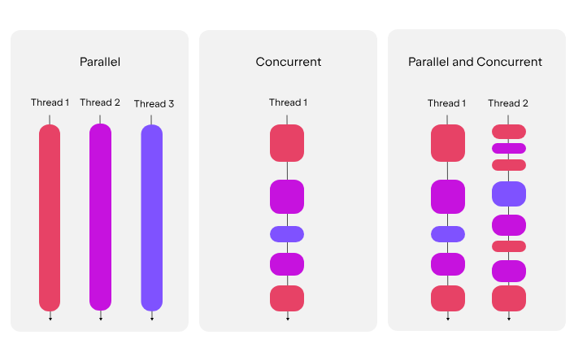
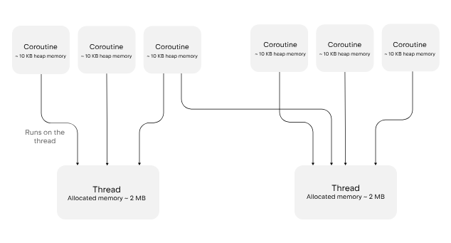

# 코루틴 개념 정리

## 1. 공식 문서 내용 정리
### 1) 개요

- 코틀린은 **일시 중지 가능한 연산 단위**를 의미
- 순차적 스타일로 동시성 코드 작성 가능
- 다른 코루틴과 동시에, 혹은 잠재적인 병렬 실행이 가능
- JVM이나 Kotlin/Native 환경에서의 코루틴은 OS가 관리하는 **스레드**에서 실행
- **코루틴은 스레드를 차단하지 않고 일시 중지**
- 이를 통해 하나의 코루틴은 데이터 도착을 기다리며 일시 중지되고, **다른 코루틴은 동일한 스레드에서 실행**될 수 있어 효과적인 자원 활용이 보장 

### 2) 자바 스레드 vs 코틀린 코루틴

- 둘다 코드를 동시에 실행 가능케 하는 연산
#### 플랫폼 스레드
- 플랫폼 스레드는 운영체제에 의해 관리 
- 기존 스레드는 여러 CPU 코어에서 작업을 병렬로 실행할 수 있으며 JVM에서 동시성을 구현하는 표준적인 접근 방식
- 스레드를 생성하면 운영체제가 스택을 위한 메모리를 할당하고 커널을 사용하여 스레드 간 전환을 수행
- 이로 인해 강력하지만 동시에 많은 자원을 소모하며, 각 스레드는 일반적으로 수 메가바이트의 메모리가 필요하고 일반적으로 JVM은 한 번에 수천 개의 스레드만 처리 가능
#### 가상 스레드(LTS 21 이후)
- 가상 스레드는 JVM이 직접 관리
- ForkJoinPool 기반의 적은 양의 플랫폼 스레드에 매핑돼서 실행됨
- OS의 커널이 직접 개입하지 않고 JVM 사용자 레벨의 스케줄링이라 전환 비용이 상대적으로 적음
- 스택을 처음부터 큰 크기로 잡지 않고 필요할 때 확장하는 구조라서 스레드당 메모리 수 KB 수준이라 수십만, 수백만 개 스레드도 생성 가능하고, 기존 플랫폼 스레드와 다르게 가상 스레드는 호출이 막히면(블로킹) JVM이 다른 플랫폼 스레드에 자동 스케줄링 처리

#### 코루틴
- 코루틴은 특정 스레드에 묶여 있지 않음
- 한 스레드에서 일시 중지된 후 다른 스레드에서 재개될 수 있으므로, 많은 코루틴이 동일한 스레드 풀을 공유 가능 
- 코루틴이 일시 중지될 때 해당 스레드는 차단되지 않고 다른 작업을 실행할 수 있는 상태를 유지하기 때문에 코루틴은 스레드보다 훨씬 가볍고, 시스템 자원을 소진하지 않으면서도 하나의 프로세스 내에서 수백만 개의 코루틴을 실행 가능

#### 결론
- 가상 스레드와 코루틴의 성능적 측면은 비슷해보이나, 근본적인 구조 차이가 있으므로 둘을 정확히 분별 & 비교해서 사용해야 될듯
- 가상 스레드는 블로킹 IO에 안전하지만, 코루틴은 그냥 블로킹 IO를 쓰면 효율이 더 떨어짐. 코루틴은 논블로킹이 권장됨